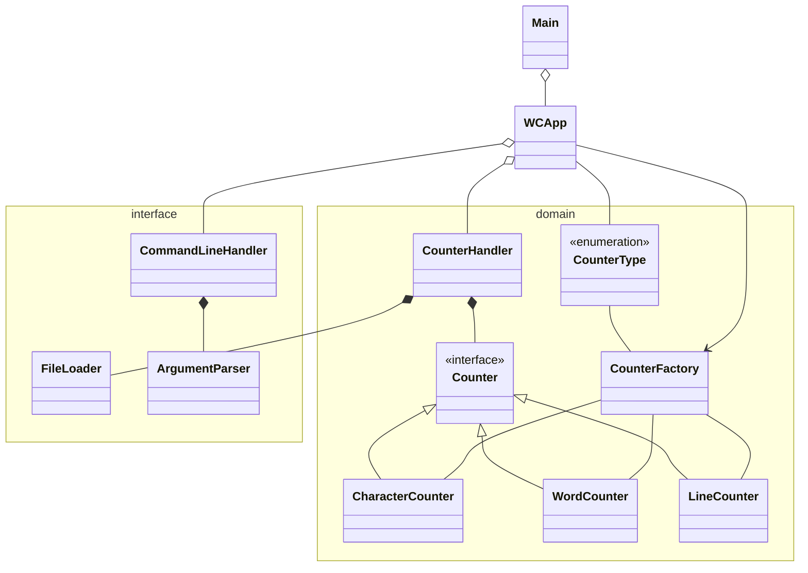

```mermaid
classDiagram
  direction TB
namespace interface{
  class FileLoader {
  }
  class CommandLineHandler {
  }
  class ArgumentParser {
  }

}
namespace domain{
  class Counter_1["Counter"] {
    <<interface>>
  }
  class CharacterCounter {
  }
  class WordCounter {
  }
  class LineCounter {
  }
  class CounterType {
    <<enumeration>>
  }
  class CounterFactory {
  }
  class CounterHandler {
  }
}
  class WCApp {
  }
  class Main {
  }
  Counter_1 <|-- CharacterCounter
  Counter_1 <|-- WordCounter
  Counter_1 <|-- LineCounter
  CounterType -- CounterFactory
  WCApp --> CounterFactory
  WCApp -- CounterType
  CounterHandler *-- FileLoader
  CounterHandler *-- Counter_1
  CommandLineHandler *-- ArgumentParser
  WCApp o-- CommandLineHandler
  WCApp o-- CounterHandler
  Main o-- WCApp
  CounterFactory -- LineCounter
  CounterFactory -- WordCounter
  CounterFactory -- CharacterCounter

```